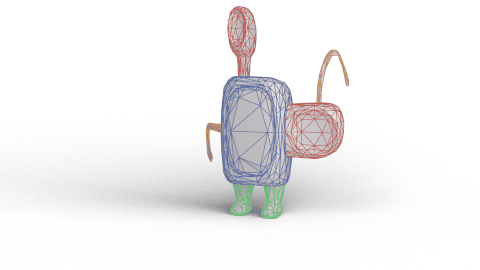
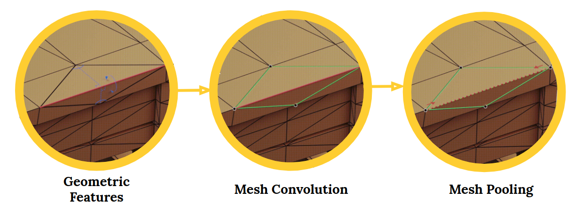

<br><br><br>

# MeshCNN in PyTorch


### SIGGRAPH 2019 [[Paper]](https://bit.ly/meshcnn) [[Project Page]](https://ranahanocka.github.io/MeshCNN/)<br>

MeshCNN is a general-purpose deep neural network for 3D triangular meshes, which can be used for tasks such as 3D shape classification or segmentation. This framework includes convolution, pooling and unpooling layers which are applied directly on the mesh edges.

 <br>

The code was written by [Rana Hanocka](https://www.cs.tau.ac.il/~hanocka/) and [Amir Hertz](http://pxcm.org/) with support from [Noa Fish](http://www.cs.tau.ac.il/~noafish/).

# Getting Started

### Installation
- Clone this repo:
```bash
git clone https://github.com/ranahanocka/MeshCNN.git
cd MeshCNN
```
- Install dependencies: [PyTorch](https://pytorch.org/) version 1.2. <i> Optional </i>: [tensorboardX](https://github.com/lanpa/tensorboardX) for training plots.
  - Via new conda environment `conda env create -f environment.yml` (creates an environment called meshcnn)
  
### 3D Shape Classification on SHREC
Download the dataset
```bash
bash ./scripts/shrec/get_data.sh
```

Run training (if using conda env first activate env e.g. ```source activate meshcnn```)
```bash
bash ./scripts/shrec/train.sh
```

To view the training loss plots, in another terminal run ```tensorboard --logdir runs``` and click [http://localhost:6006](http://localhost:6006).

Run test and export the intermediate pooled meshes:
```bash
bash ./scripts/shrec/test.sh
```

Visualize the network-learned edge collapses:
```bash
bash ./scripts/shrec/view.sh
```

An example of collapses for a mesh:

 

Note, you can also get pre-trained weights using bash ```./scripts/shrec/get_pretrained.sh```. 

In order to use the pre-trained weights, run ```train.sh``` which will compute and save the mean / standard deviation of the training data. 


### 3D Shape Segmentation on Humans
The same as above, to download the dataset / run train / get pretrained / run test / view
```bash
bash ./scripts/human_seg/get_data.sh
bash ./scripts/human_seg/train.sh
bash ./scripts/human_seg/get_pretrained.sh
bash ./scripts/human_seg/test.sh
bash ./scripts/human_seg/view.sh
```

Some segmentation result examples:

   

### Additional Datasets
The same scripts also exist for COSEG segmentation in ```scripts/coseg_seg``` and cubes classification in ```scripts/cubes```. 

# More Info
Check out the [MeshCNN wiki](https://github.com/ranahanocka/MeshCNN/wiki) for more details. Specifically, see info on [segmentation](https://github.com/ranahanocka/MeshCNN/wiki/Segmentation) and [data processing](https://github.com/ranahanocka/MeshCNN/wiki/Data-Processing).

# Other implementations
- [Point2Mesh tensorflow reimplementation](https://github.com/dcharatan/point2mesh-reimplementation), which also contains MeshCNN
- [MedMeshCNN](https://github.com/Divya9Sasidharan/MedMeshCNN), handles meshes with 170k edges

# Citation
If you find this code useful, please consider citing our paper
```
@article{hanocka2019meshcnn,
  title={MeshCNN: A Network with an Edge},
  author={Hanocka, Rana and Hertz, Amir and Fish, Noa and Giryes, Raja and Fleishman, Shachar and Cohen-Or, Daniel},
  journal={ACM Transactions on Graphics (TOG)},
  volume={38},
  number={4},
  pages = {90:1--90:12},
  year={2019},
  publisher={ACM}
}
```


# Questions / Issues
If you have questions or issues running this code, please open an issue so we can know to fix it.
  
# Acknowledgments
This code design was adopted from [pytorch-CycleGAN-and-pix2pix](https://github.com/junyanz/pytorch-CycleGAN-and-pix2pix).
