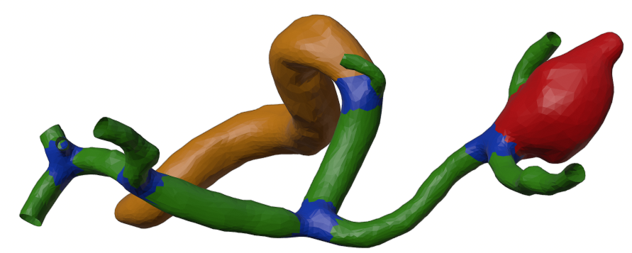

<br><br><br>


# MedMeshCNN

MedMeshCNN is an expansion of [MeshCNN](https://ranahanocka.github.io/MeshCNN/) proposed by  [Rana Hanocka](https://www.cs.tau.ac.il/~hanocka/) et al. 

[MeshCNN](https://ranahanocka.github.io/MeshCNN/) is a general-purpose deep neural network for 3D triangular meshes, which can be used for tasks such as 3D shape classification or segmentation. This framework includes convolution, pooling and unpooling layers which are applied directly on the mesh edges.

MedMeshCNN enables the use of [MeshCNN](https://ranahanocka.github.io/MeshCNN/) for medical surface meshes through an improved memory efficiency that allows to 
to keep patient-specific properties and fine-grained patterns during segmentation. Furthermore, a weighted loss function improves the performance of MedMeshCNN on imbalanced datasets that are often caused by pathological appearances. 

MedMeshCNN may also be used beyond the medical domain for all applications that include imbalanced datasets and require fine-grained segmentation results.

Advances of MedMeshCNN include: 
* Processing meshes with 170.000 edges (NVIDIA GeForce GTX 1080 TiGPU with 12GB RAM)
* IoU metrics
* Weighted loss function to enable better performances on imbalanced class distributions

Please check out the corresponding [PartSegmentationToolbox](https://github.com/LSnyd/PartSegmentationToolbox) to find further information on how to create a  segmentation ground truth and helper scripts to scale segmentation results to different mesh resultions. 


# Getting Started


### Installation
- Clone this repo:
```bash
git clone https://github.com/LSnyd/MedMeshCNN.git
cd MedMeshCNN
```
- Install dependencies: [PyTorch](https://pytorch.org/) version 1.4. <i> Optional </i>: [tensorboardX](https://github.com/lanpa/tensorboardX) for training plots.
  - Via new conda environment `conda env create -f environment.yml` (creates an environment called meshcnn)


### 3D Shape Segmentation on Humans
Download the dataset
```bash
bash ./scripts/human_seg/get_data.sh
```

Run training (if using conda env first activate env e.g. ```source activate meshcnn```)
```bash
bash ./scripts/human_seg/train.sh
```

To view the training loss plots, in another terminal run ```tensorboard --logdir runs``` and click [http://localhost:6006](http://localhost:6006).

Run test and export the intermediate pooled meshes:
```bash
bash /scripts/human_seg/test.sh
```

Visualize the network-learned edge collapses:
```bash
bash ./scripts/human_seg/view.sh
```

Some segmentation result examples:

   

### Hyperparameters

To alter the values of the hyperparameters, change the bash scripts above accordingly. 
This also includes the weight vector for the weighted loss function, which requires one weight per class. 


### More Info


Check out the corresponding [PartSegmentationToolbox](https://github.com/LSnyd/PartSegmentationToolbox) and my [medium article](https://medium.com/@lisa_81193/how-to-perform-a-3d-segmentation-in-blender-2-82-d87300305f3f) to find further information on how to create a segmentation ground truth as illustrated below. You can also find helper scripts that scale segmentation results to different mesh resolutions. 



Also check out the [MeshCNN wiki](https://github.com/ranahanocka/MeshCNN/wiki) for more details. Specifically, see info on [segmentation](https://github.com/ranahanocka/MeshCNN/wiki/Segmentation) and [data processing](https://github.com/ranahanocka/MeshCNN/wiki/Data-Processing).


# Questions / Issues
If you have questions or issues running this code, please open an issue.